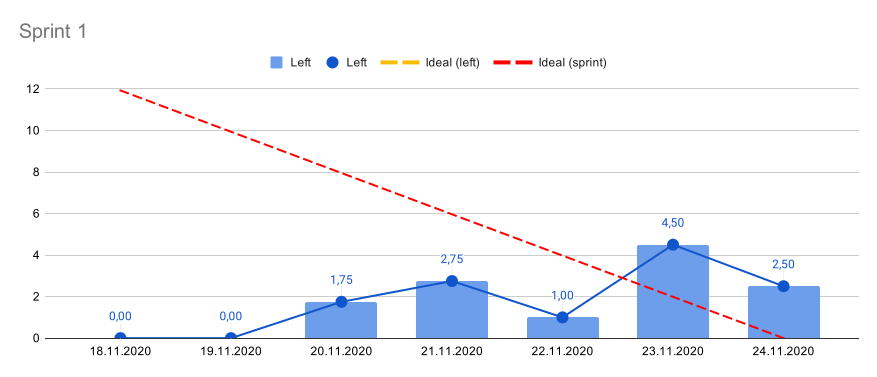

# Burndown chart

Burndown chart is created by scraping data from the sprint board using [Google Apps script](Koodi.js), which writes the scraped data to Google spreadsheet. Then using built-in spreadsheet functions, the burndown chart is plotted.

## Development
[Command Line Apps Script Projects](https://github.com/google/clasp) (clasp) can be used for local development.

#### Spreadsheet 
https://docs.google.com/spreadsheets/d/1vvnHpUUH4D7kOmk_UIf7jPRziTpdBS7EsQDth8bS1j4/

## Charts of the previous sprints
